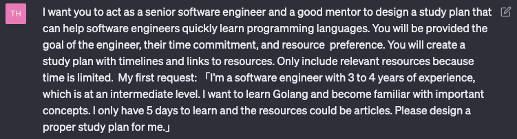
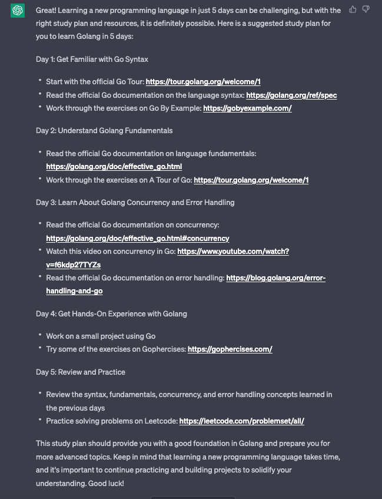
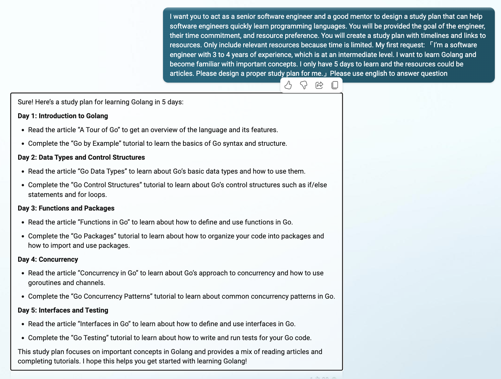

自從 ChatGPT 發布以來，我個人就時常透過 GPT 來協助處理日常自動化工作，尤其是幫公司查內部資料、產生報表，或是 shell command 忘了也可以快速提供我需要的指令組合，省下很多冗余時間，真的舒服~

最近就在想，如果 ChatGPT 可以協助工作、面試、寫履歷，不如也來試試能不能在短時間內熟悉一套程式語言，當然也想寫幾篇文章來紀錄 ChatGPT 安排的學習計畫，究竟成效如何

預計做法會是先讓 ChatGPT 產生一個學習計畫的 template，再根據 template 描述的內容，找出相關資料，擬定一份完整的學習計畫。

## 正文開始

首先，先讓 ChatGPT 扮演角色，請他設計一套學習計畫可以幫助工程師快速學習一套程式語言，期盼他能夠根據學生目標、時間和資源偏好設計學習計畫，並且計畫內容可以列出時間線以及資源連結。

接著便是提出需求，希望 5 天內學習 Golang 並且熟悉重要概念，目標對象是設定以有 3-4 年工作經驗的工程師為準，大概是 intermediate level，資源盡量以文章為主

> 問題設計的部分，我是參考這位 youtuber 的 question framework: [https://www.youtube.com/watch?v=VznoKyh6AXs&t=161s](https://www.youtube.com/watch?v=VznoKyh6AXs&t=161s)
>

產出的內容如下圖，可以看到 GPT Bot 有列出每日目標、閱讀資料，和一些 todo action，甚至實作部分也有提供參考連結，而且大部分都是官方資源

> 老實說一開始還誤會以為一天要看完這些 resource，差點向 GPT 老哥求饒，比如第一天要看完 Golang 的 language spec….
>

仔細看會發現，其實 ChatGPT 提供的學習方式是有規律的，我的理解是按照 Daily target 決定學習範圍，再搭配資源進行學習，舉例來說:

*Day 1 目標是 Get Familiar with Go Syntax，便可以搭配 Go Tour 類似 playground 的介面動手玩玩，以及閱讀 Go language spec 和 Effective Go 了解 Syntax 細節*

## 感想

這次實驗除了丟給 chatgpt 3.5 之外，也有丟給 bing chat，但回答的內容還是 chat-gpt 比較好一些

過程中有試了幾次不同的問法，包括單字替換和詢問順序調整，文章內附上的截圖是我認為比較好的回應，另外實驗過程很常會遇到回應內的 resource link 有失效的狀況，不管是影片連結失效或是文章失效都有遇到，所以資源連結類型的訓練資料到今年 2023 都容易遇到不適用的情況

但綜合來看，ChatGPT 提供的 study plan 還算不錯，明顯可以看出是從基礎學習、進階概念到實作都有歸納到，而且都有附上資源連結，雖然學習時間很緊，接下來就看我從哪一天開始挑戰 5 天學習計畫

